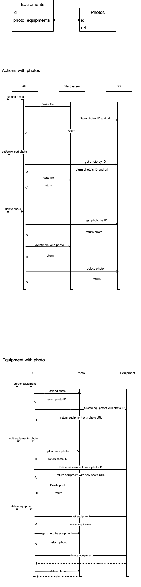

# CSR Backend API

This is the CSR backend API service built with Go, providing RESTful endpoints documented via Swagger.

## Prerequisites

- **Go 1.25+** (recommended: Go 1.25 or later)
- **Docker & Docker Compose** (for containerized setup)
- **PostgreSQL 14** (if running locally without Docker)
- **Make** (for running commands)

## Quick Links

- [Main Documentation](#readme)
- [Setup Guide](./SETUP_GUIDE.md)
- [Docker Setup & Troubleshooting](./DOCKER.md) ⚠️ Important for Colima/Podman users
- [Quick Reference](./QUICK_REFERENCE.md)

## Quick Start

### Option 1: Automated Local Setup (Recommended)

This script automates all the necessary steps to get the project running locally, including checking prerequisites, installing tools, generating code, and starting the database.

1. **Clone the repository**

   ```bash
   git clone https://github.com/CSR-LC/csr-be.git
   cd csr-be
   ```

2. **Make the script executable**

   ```bash
   chmod +x setup.sh
   ```

3. **Run the setup script**

   ```bash
   ./setup.sh
   ```

   The script will guide you through the process. Once it's complete, you are ready to run the application.

4. **Run the service**

   ```bash
   make run
   ```

### Option 2: Manual Local Setup

If you prefer to run each step manually or if the setup script fails, follow these instructions.

1. **Clone the repository**

   ```bash
   git clone https://github.com/CSR-LC/csr-be.git
   cd csr-be
   ```

2. **Install Go dependencies and tools**

   ```bash
   make setup
   ```

3. **Generate required Go files** (Swagger, Ent, Mocks)

   ```bash
   make generate
   ```

4. **Start the PostgreSQL database**

   ```bash
   make db
   ```

   Wait for PostgreSQL to be ready (you can check with `docker ps`)

5. **Run the service**

   ```bash
   make run
   ```

### Option 3: Running with Docker Compose

This option runs both the application and database in containers.

1. **Prerequisites**

   - Install [Git](https://git-scm.com/downloads)
   - Install [Docker Desktop](https://docs.docker.com/desktop/)

2. **Update configuration**

   Edit `config.json` and change the database host to:

   ```json
   {
     "database": {
       "host": "postgres"
     }
   }
   ```

3. **Build and start all services**

   ```bash
   make rebuild_project
   ```

   Or if you've already built before:

   ```bash
   make start_project
   ```

4. **Access the application**

   - API: http://localhost:8080/api
   - Swagger: http://localhost:8080/api/docs

5. **Stop the services**
   ```bash
   make stop_project
   ```

## Accessing the Application

Once the application is running (via local setup or Docker Compose), you can access it at:

- API Base URL: http://127.0.0.1:8080/api
- Swagger Documentation: http://127.0.0.1:8080/api/docs

### Test the API

Use the generated Swagger API docs to test the API and see available parameters.

## Available Make Commands

Run `make help` to see all available commands, or refer to the list below:

### Setup

- `make setup` - Install required Go tools (swagger, ent, mockery)
- `make setup_alpine` - Install dependencies for Alpine Linux

### Development

- `make run` - Run the application locally
- `make db` - Start PostgreSQL database container
- `make generate` - Generate all code (swagger, ent, mocks)
- `make build` - Build the application binary

### Testing

- `make test` - Run unit tests
- `make lint` - Run linter (requires golangci-lint)
- `make coverage` - Show test coverage report
- `make int-test` - Run integration tests

### Docker Compose

- `make build_project` - Build Docker containers
- `make rebuild_project` - Rebuild containers from scratch (includes pulling updates)
- `make start_project` - Start all services
- `make stop_project` - Stop all services
- `make restart_project` - Restart all services

### Cleanup

- `make clean` - Clean generated files and binaries

## Project Structure

```
.
├── cmd/swagger/          # Application entry point
├── internal/
│   ├── ent/schema/      # Database schema definitions
│   ├── generated/       # Auto-generated code
│   │   ├── ent/        # Ent ORM generated code
│   │   ├── swagger/    # Swagger generated code
│   │   └── mocks/      # Test mocks
│   └── ...
├── swagger.yaml         # API specification
├── config.json          # Application configuration
├── Makefile            # Build and development commands
└── docker-compose.yml  # Docker services configuration
```

## Configuration

The application uses `config.json` for configuration. Key settings:

- **Database connection**: Host, port, username, database name
- **Server port**: Default is 8080
- **File storage**: Set via `PHOTOS_FOLDER` environment variable

### Environment Variables

- `PHOTOS_FOLDER` - Directory for file storage (default: `./photos`)

## Development Workflow

### Making Changes to the API

1. Update `swagger.yaml` with your API changes
2. Regenerate code: `make generate/swagger`
3. Restart the service: `make run`

### Updating Database Schema

1. Modify schemas in `internal/ent/schema/`
2. Regenerate Ent code: `make generate/ent`
3. Run database migrations (if applicable)

### Running Tests

```bash
# Unit tests
make test

# Integration tests (requires Docker)
make int-test

# View coverage
make coverage
```

## File Storage

Files are stored in the filesystem with the following workflow:

1. Files are uploaded and stored in the directory specified by `PHOTOS_FOLDER`
2. The database stores file IDs (filenames without extensions)
3. File retrieval uses the ID to locate files in the storage directory



## Tools Used

- **[go-swagger](https://github.com/go-swagger/go-swagger)** - Swagger code generation
- **[Ent](https://entgo.io/)** - Entity framework for Go
- **[Mockery](https://github.com/vektra/mockery)** - Mock generation for testing

## Generating a Database Schema Diagram

You can generate an Entity-Relationship (ER) diagram of the live database schema using SchemaCrawler and Docker. This is available as a `make` command.

**Prerequisites:**

- Docker must be installed and running.
- The project's PostgreSQL database must be running (start it with `make db`).

**Command:**

```bash
make schema
```

This will connect to your local database and generate a file named `schema.svg` in the project root.

**To view the diagram:**

- **On macOS:** Run `open schema.svg`
- **On other systems:** Open the `schema.svg` file in any web browser.

## Troubleshooting

### Database Connection Issues

- Ensure PostgreSQL is running: `docker ps`
- Check `config.json` has correct database host:
  - For local run: `"host": "localhost"`
  - For Docker Compose: `"host": "postgres"`

### Port Already in Use

- Check if port 8080 is available: `lsof -i :8080`
- Stop conflicting services or change port in configuration

### Generate Command Fails

- Ensure all tools are installed: `make setup`
- Check Go version: `go version` (should be 1.25+)

### Docker Issues

- Ensure Docker is running: `docker info`
- Rebuild containers: `make rebuild_project`

## Contributing

1. Fork the repository
2. Create a feature branch
3. Make your changes
4. Run tests: `make test`
5. Submit a pull request

## License

TODO - Add license information here
